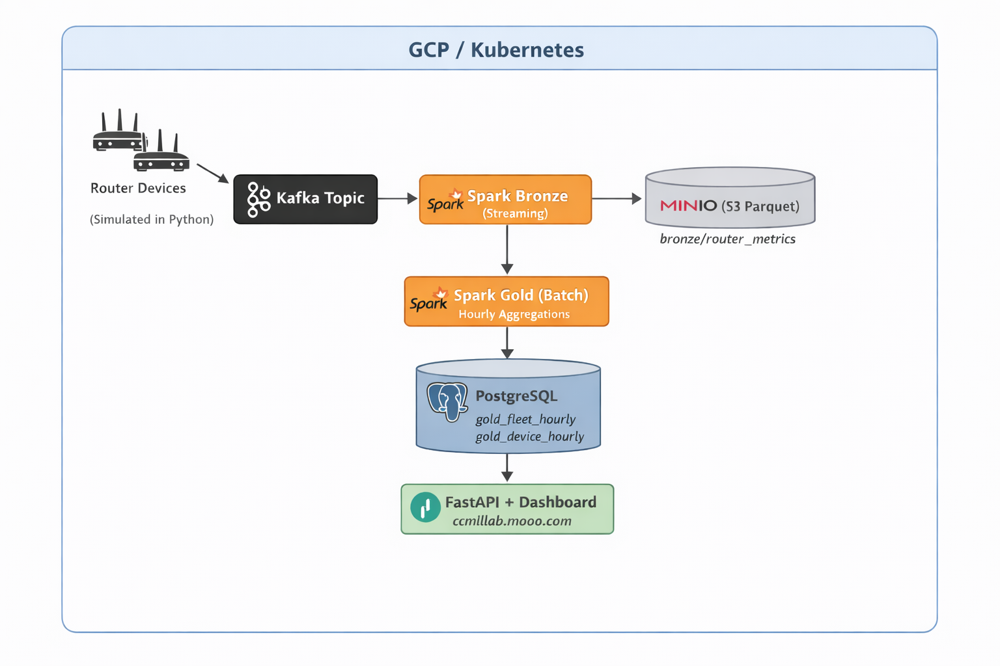

# Network Telemetry Pipeline

A scalable real-time data platform for ingesting, processing, and analyzing router telemetry metrics from a fleet of 200+ network devices.

## Architecture



## Repositories

| Repository | Description |
|------------|-------------|
| [infrastructure](../infra/) | Terraform (GCP VMs) + Ansible (Kubernetes cluster bootstrap, 17 roles) |
| [data-pipeline](../data-pipeline/) | Spark Structured Streaming jobs + ArgoCD GitOps manifests |
| [data-producer](../data-producer/) | Python Kafka producer replaying 288k rows of synthetic router metrics |
| [telemetry-dashboard](../telemetry-dashboard/) | FastAPI backend + Chart.js single-page dashboard |

## Data Flow

```
Router Metrics → Kafka (router.metrics.raw) → Spark Streaming → MinIO S3 (Parquet)
    → Spark Batch (60s) → PostgreSQL (hourly aggregates) → FastAPI → Dashboard
```

**Metrics collected:** CPU, memory, throughput (in/out), packet loss, BGP state, health status — per device, per hour.

## Tech Stack

| Layer | Technologies |
|-------|-------------|
| Infrastructure | Terraform, Ansible, GCP |
| Kubernetes | kubeadm, Cilium CNI, NGINX Ingress, Cert-Manager |
| Messaging | Apache Kafka (Strimzi, KRaft mode) |
| Processing | Apache Spark 3.5 Structured Streaming + batch |
| Storage | MinIO AIStor (S3-compatible), PostgreSQL 16 |
| API | Python, FastAPI |
| Frontend | Chart.js, vanilla HTML/JS |
| GitOps | ArgoCD |
| Observability | Prometheus, Grafana |

## Deployment

```bash
# 1. Configure GCP credentials and terraform.tfvars
cd infra/terraform
cp terraform.tfvars.example terraform.tfvars  # set project_id, admin_cidr, ssh key

# 2. Create a static IP for DNS
gcloud compute addresses create ml-lab-w01-ip --region=europe-west1

# 3. Point your domain's A record to the static IP, then deploy everything
cd infra
./deploy.sh all
# Provisions 3 GCP VMs → bootstraps Kubernetes → installs platform services → deploys pipeline
```

**Access:**
- Dashboard: https://ccmllab.mooo.com
- ArgoCD: https://ccmllab.mooo.com/argocd
- Grafana: https://ccmllab.mooo.com/grafana

**Teardown:**
```bash
cd infra/terraform && terraform destroy
```

## Demo

Live dashboard: **https://ccmllab.mooo.com**

![Fleet dashboard showing CPU p95, packet loss trends, and top devices by metric]

The dashboard shows real-time fleet-wide KPIs, hourly trend charts, and per-device drill-down for 200 simulated routers across multiple regions.
